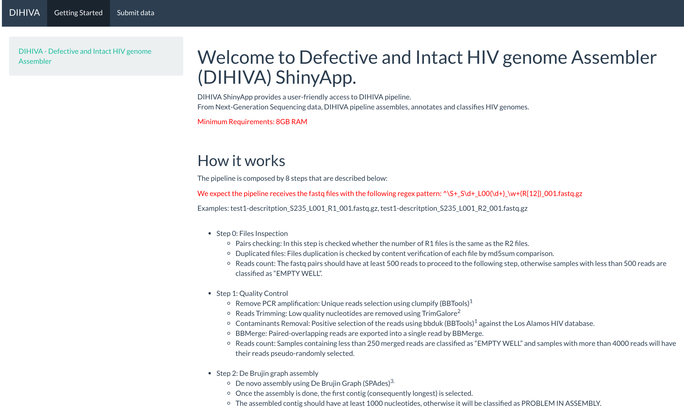
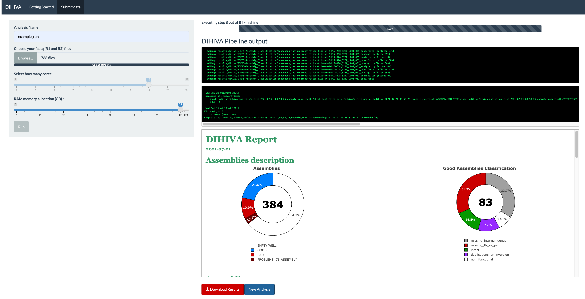
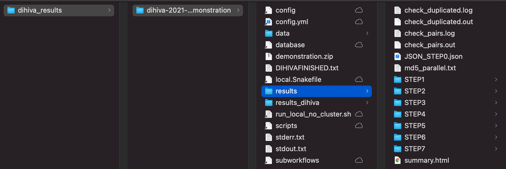

[](https://circleci.com/gh/stratust/HIVA/tree/cleanupv2)  

# Defect and Intact HIV genome Assembler (DIHIVA)

#### Table of Contents

* [Docker Installation](#installing-docker-desktop-on-macos-and-windows)
* [Downloading Image](#downloading-image)
* [DIHIVA Execution - Using the R/Shiny Interface](#executing-dihiva-using-the-r/shiny-interface)
* [DIHIVA Execution - Using Command Line](#executing-dihiva-using-command-line)
* [DIHIVA Fastq Files Example](#fastq-file-example)


## Installing Docker Desktop on macOS and Windows

On the official [Docker website](https://www.docker.com/products/docker-desktop), click on the button **"Download for Mac"** for macOS users or **"Download for Windows"** for Windows OS users.


Regardless the selected OS, a new web page will be open and the dmg file can be downloaded clicking on the button **"Get Docker"**


The same web page describes:

## Install it on macOS
Double-click Docker.dmg to start the install process.

When the installation completes and Docker starts, the whale in the top status bar shows that Docker is running, and accessible from a terminal.


## Install it on Windows
Double-click Docker for Windows Installer to run the installer.

When the installation finishes, Docker starts automatically. The whale  in the notification area indicates that Docker is running, and accessible from a terminal.

## Downloading Image:

Once Docker is installed, download the image containing the DIHIVA on https://hub.docker.com/r/victoorramos/dihiva
  

Open up a terminal session and download the image using the command

```
docker pull victoorramos/dihiva
```

  


## Executing DIHIVA - Using R/Shiny

### Step 1

In Desktop, create a folder named "dihiva_results" and type the following command to start the Shiny application and make it accessible through the port 7524 ( The user may choose any other port that is not being used and map it in the command below ).

```
docker run -it -p 7524:8888 -v ~/Desktop/dihiva_results/:/dihiva/dihiva_analysis victoorramos/dihiva:latest /bin/bash -c "R -e 'shiny::runApp("'"/dihiva/DIHIVAInterface"'", port=8888, host="'"0.0.0.0"'")'" 
```

  

### Step 2

Using the internet browser of your preference, type localhost:7524 to access the DIHIVA Shiny application.  

  


### Step 3

On the tab 'Submit data', the user will be able to name the analysis, select the fastq files to be used and select how many cores will be available to process the results ( the amount of cores available is the amount of cores set on Docker settings ).  

  

Once the user selects the fastq files to be used, a button 'Run' will be displayed to start the pipeline execution.  


### Step 4

At the end of the processing, a report summarizing all the assemblies will be displayed as well as an option to download it and start a new analysis.

  

Also, the result for each step will be available in the folder created in Desktop.

  


## Executing DIHIVA - Command line

### Step 1

In Desktop, create a folder named "dihiva_results". Inside it, create a folder with a name of your preference. Inside this folder, one new folder should be created, named 'data'. Inside data transfer all the fastq files that will be used.  

  

### Step 2

Execute docker on interactive mode with the following command: 
```
docker run -it -v  ~/Desktop/dihiva_results/:/dihiva/dihiva_analysis victoorramos/dihiva:latest
```

### Step 3

Enter the directory previously created inside 'dihiva_analysis' and execute the command:
```
setup_hiv_loca.sh .
```
The command above will create symbolic links to all files the pipeline needs to be executed.

  

### Step 4

Execute the pipeline with the command:
```
./run_local_no_cluster.sh <number_of_cores> <analysis_name> <ram_mem_allocation>
```

Mem allocation should be provided in Mb. For example 10GB should be passed as 10000

  

As we use Snakemake to handle parallel processing, the execution can be easily adapted to a [cluster environment](https://snakemake.readthedocs.io/en/stable/executing/cluster.html).

## Fastq Files Example

[Download](https://www.dropbox.com/sh/jbzy6s0frfpof36/AADYCqmLRxWrXa2e10KsRY9ia?dl=0) of fastq files for practicing.
